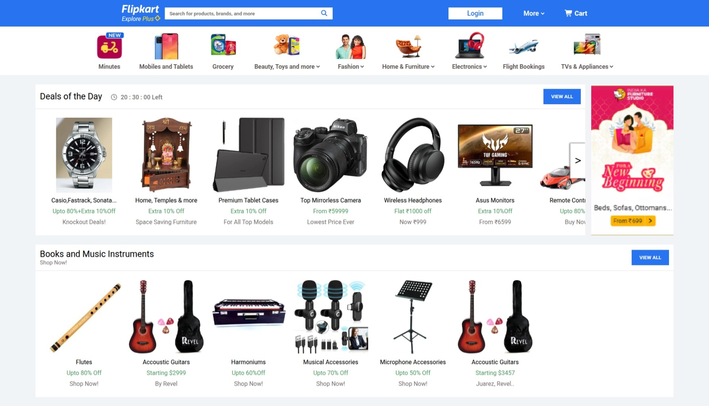
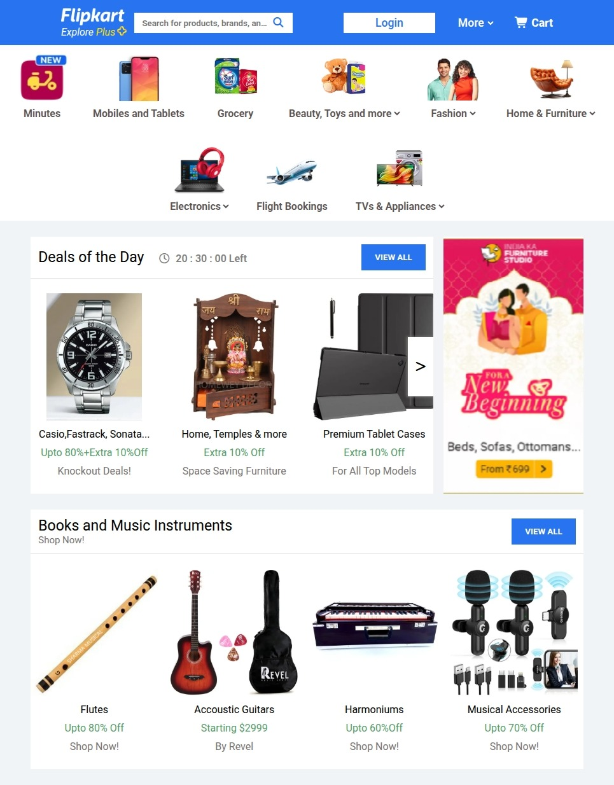

# Flipkart Clone 🛒

A responsive Flipkart UI clone built using HTML & CSS.

## Features

- Responsive Flipkart-like UI built with semantic HTML and CSS
- Desktop and mobile layouts using CSS Grid/Flexbox and media queries
- Product grid, header with search, navigation, and footer styling
- Hover states and basic accessibility considerations

## Technologies

- HTML5
- CSS3 (Flexbox, Grid, Media Queries)

## Installation

Follow the steps below to run the project locally.

### Clone the repository

Replace `<repo-url>` with the actual repository URL:

```bash
git clone <repo-url>
```

Navigate into the project directory
cd html_and_css_assessment

Open the project in your browser

Open index.html using the command for your operating system:

### macOS
```bash
open index.html
```

### Linux

```bash
open index.html
```

### Windows (PowerShell)

```powershell
start index.html
```

## Project Structure

- index.html
- styles.css
- images/
  - Desktop_View.jpeg
  - tablet_view.jpeg
  - mobile.jpeg
- readme.md

## Usage

- View on desktop and resize the browser or use device emulator to test responsiveness.
- Update HTML/CSS files to customize layout, colors, or content.

## Screenshots

### Desktop View 



### Tablet View


### Mobile View


## Contributing

Contributions are welcome! You can:

  - Fork the repository

  - Create a new branch (git checkout -b feature/your-feature)
  - Commit your changes (git commit -m "Add feature")

  - Push to the branch (git push origin feature/your-feature)

  - Open a Pull Request

## License

This project is for assessment purposes. Modify and use as needed.